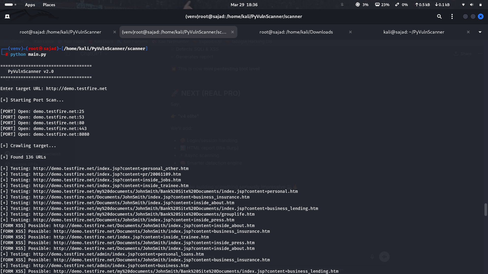
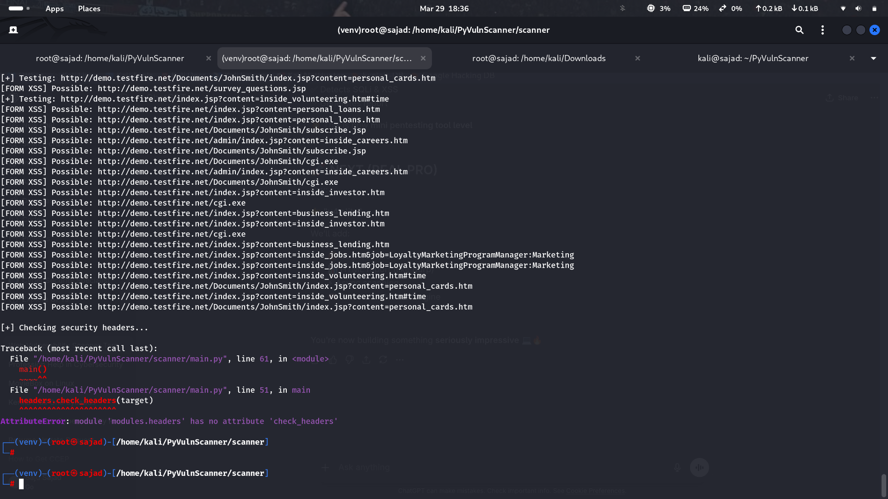

# 🔐 PyVulnScanner


A Python-based Web Vulnerability Scanner designed to detect common web vulnerabilities such as SQL Injection and Cross-Site Scripting (XSS).

---

## 🚀 Features

- 🕷️ Web Crawling  
- 💉 SQL Injection Detection  
- ⚡ XSS Detection  
- 🔐 Form-Based Scanning (GET & POST)  
- 📂 Directory Enumeration  
- 🛡️ Security Header Analysis  
- 🌐 Port Scanning  
- ⚡ Multi-threaded scanning  
- 📄 Report generation  

---

## 🛠️ Technologies Used

- Python  
- Requests  
- BeautifulSoup  

---

## ▶️ Usage

```bash
python main.py
---

## 📸 Screenshots

### 🔍 Scanner Running


### 📊 Scan Results


---

## ⚠️ Disclaimer

This tool is created for educational purposes only.  
Do not use it on unauthorized systems.

---

## 👨‍💻 Author

Muhammed Sajad  
Cybersecurity Student | Ethical Hacking | SOC Analyst Aspirant
